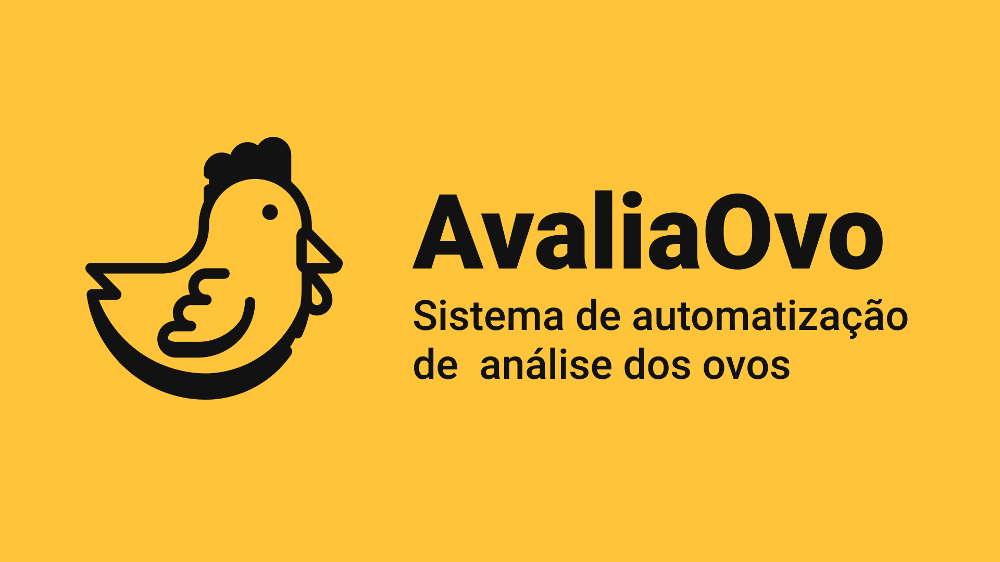

<p align="center">

</p>

## 📌 Do que se trata?
AvaliaOvo é um sistema de automação e sistematização de dados de ovos e seus componentes para medir e avaliar o indíce da cor de seus componentes. Desenvolvido pelas Instituições Federais Universidade do Agreste Pernambucano (UFAPE) e Insituto Federal de Pernambuco (IFPE).

## 💻 Tecnologias

* React
* Axios
* Google Charts (React Wrapperr)
* HTML/CSS/JS

## 🚀 Inicializando o projeto

Para que o sistema rode na sua máquina é necessário uma série de etapas listadas a baixo:

### ⚙️ Pré-Requisitos

O código deste repositório se refere a parte do Front-end da aplicação AvaliaOvo. Para fazê-la funcionar é necessário ter o Back-end pronto na sua máquina. Para isto, acesse este repositório: [Back-end AvaliaOvo](https://github.com/Nidhoggui/heroku-avicultura-backend)

### ⏬ Instalação

Tendo os pré-requisitos já configurados,vamos começar clonando o repositório na nosssa máquina. Para isso escolha uma pasta onde será clonado o repositório,abra o terminal/cmd e use o comando do *git* abaixo:
```
git clone https://github.com/JuanGustah/frontend-avicultura
```
Após isso,use ``cd frontend-avicultura`` para acessar o projeto clonado.

A segunda etapa será instalar as bibliotecas necessária do sistema para garantir seu funcionamento. Estando na pasta do projeto via terminal/cmd use:

```
npm install
```
Após baixado, vá em **src>services>api.js** e via Editor de código mude as linhas abaixo:

```
const api = axios.create({
    baseURL: process.env.REACT_APP_API_URL,
})

```
para o modelo abaixo

```
const api = axios.create({
    baseURL: "http://localhost:[porta em que o back-end está sendo executado]",
})

```
Por fim utilize o comando para rodar a aplicação em localhost:

```
npm start
```
Ele executará e abrirá no seu navegador mas caso não abra cole o link: **localhost:3000** em seu navegador e você verá a aplicação funcionando.

## 🙏 Atribuições

- [Flaticon](https://www.flaticon.com/) Pelos ícones utilizados no sistema.
- [unDraw](https://undraw.co/)  Pelas figuras utilizadas no sistema.

## 💛 Do nosso time para todos:
Obrigado por visualizar nosso projeto, se precisar de alguma ajuda, sinta-se livre para abrir uma issue com a descrição do problema.


